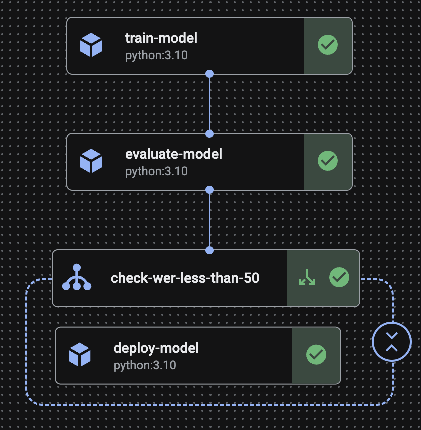

# Fine-tuning Whisper for Hindi ASR in a Vertex AI Custom Job

This project fine-tunes the OpenAI Whisper `small` model for Automatic Speech Recognition (ASR) in Hindi using the Common Voice dataset. The training script has been largely taken from the Hugging Face Whisper fine-tuning example: https://colab.research.google.com/github/sanchit-gandhi/notebooks/blob/main/fine_tune_whisper.ipynb and adapted to run on Google Cloud's Vertex AI as an MLOps (train, eval and deploy) pipeline. The GCP MLOps demo was also a huge help: https://github.com/meken/gcp-mlops-demo.

## Description

The training logic is in the `trainer/task.py` script, which automates the process of:

1.  Downloading the Hindi Common Voice dataset.
2.  Preprocessing the audio and text data.
3.  Fine-tuning the `openai/whisper-small` model.
4.  Evaluating the model using the Word Error Rate (WER) metric.
5.  Deploying the model to a Vertex AI Prediction endpoint for online inference.



## Folder Structure

```text
├── src/trainer/
│   └── __init__.py
│   └── task.py       # Main script for data processing and model training and evaluation.
│   └── pipeline.py   # KFP Pipeline definition
├── submit.py  # Script to trigger the Vertex AI Pipeline job

```

## Steps to run the Vertex AI Pipeline with uv

1.  **Clone the repository**

```bash
git clone https://github.com/janeyasmin/whisper-finetune-vertex-ai.git
cd whisper-finetune-vertex-ai/
```

2. **Install Dependencies with uv:**

```bash
uv sync --extra gcp
```

3. **Activate the uv shell**:

```bash
source .venv/bin/activate
```

4. **Build the package into a source distribution:**

```bash
uv build
```

5. **Authorise the gcloud CLI to access Google Cloud via your user account:**

```bash
gcloud auth login
```

6. **Upload the source distribution TAR file to your Google Cloud Storage bucket:**

```bash
gsutil cp -r ./dist/*.tar.gz gs://<your-bucket-name>
```

7. **Compile the pipeline:**

```bash
python3 -m src.trainer.pipeline
```

8. **Rename the file ".env.example" to ".env" and fill the below values:**

```bash
# Mozilla API key for downloading the dataset
MOZILLA_API_KEY=YOUR_VALUE_HERE # get an API key from: https://datacollective.mozillafoundation.org/profile/credentials

# GCP project config
GOOGLE_CLOUD_PROJECT_ID = YOUR_VALUE_HERE

# GCP region where the Vertex AI resources will be created
GOOGLE_CLOUD_PROJECT_LOCATON = YOUR_VALUE_HERE

# Google Cloud Storage bucket where artifacts are stored
GCS_BUCKET_URI = YOUR_VALUE_HERE # gs://your-bucket-name
```

9. **Authenticate for using Cloud Client Libraries by setting up Application Default Credentials.**

```bash
gcloud auth application-default login
```

10. **Submit the asynchronous Vertex AI Pipeline job**

```bash
python3 submit.py
```

## Model

This project uses the `openai/whisper-small` model, a powerful and efficient model for ASR. The model is fine-tuned for transcription in Hindi.

## Dataset

The dataset used for fine-tuning is the Hindi portion of the [Mozilla Common Voice](https://datacollective.mozillafoundation.org/datasets/cmj8u3p7m00b1nxxbm34a993r/) dataset. The script automatically downloads and prepares the dataset.

## Results

With 1000 steps, 1 hr 44 min training on 1 x T4 GPU (n1-standard-16), the fine-tuned model achieved a 38% WER on the Mozilla Common Voice Hindi Dataset, a 20% improvement from the base model.


